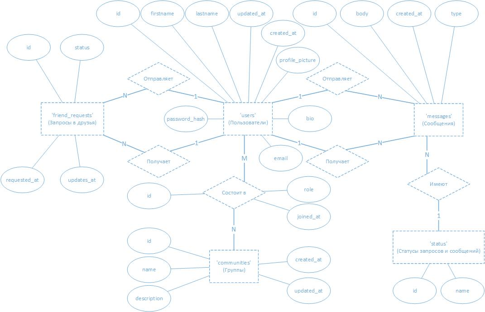

# ПРОМЕЖУТОЧНАЯ АТТЕСТАЦИЯ 1

Исполнитель: Боталов Константин Владимирович

## Постановка задания

1. Вы успешно устроились на работу специалистом по SQL, но вдруг начальство решило передать вам наработки другого специалиста по разработке БД для социальной сети. Вам надо проанализировать код в файле [create.txt](src/create.txt), обдумать как можно улучшить данную БД.
2. Вы должны описать текстом какая информация содержится в каждой таблице, объяснить смысл каждого внешнего ключа. И сразу же отметить, что можно улучшить.
3. Разработайте логическую модель БД, уже включая ваши улучшения.
4. Измените код создания и наполнения БД в соответствии с вашими предложениями, запустите его.
5. Найдите всех друзей пользователя с id = 1.
6. Найдите все сообщения, в которых принимал участие пользователь id = 1.
7. Найдите всех пользователей, кто состоит в сообществе 'beatae’.
8. Найдите всех пользователей, кто отправлял сообщение содержащее слово 'culpa'.
9. (сложное необязательное) Найдите друзей друзей пользователя с id = 1.

## Выполнение задания

### Анализ таблиц и их улучшение

В этой структуре базы данных для социальной сети мы имеем пять таблиц: **users**, **messages**, **friend_requests**, **communities** и **users_communities**.

#### Описание таблиц

1. Таблица **'users' (Пользователи)**:
    - **Содержимое:**
        - **id:** уникальный идентификатор пользователя (первичный ключ).
        - **firstname:** имя пользователя.
        - **lastname:** фамилия пользователя.
        - **email:** адрес электронной почты пользователя (должен быть уникальным).
    - **Назначение:** хранение основных данных о пользователе.
    - **Внешние ключи:** отсутствуют.

2. Таблица **'messages' (Сообщения)**:
    - **Содержимое:**
        - **id:** уникальный идентификатор сообщения (первичный ключ).
        - **from_user_id:** идентификатор пользователя, отправившего сообщение.
        - **to_user_id:** идентификатор пользователя, получившего сообщение.
        - **body:** текст сообщения.
        - **created_at:** временная метка создания сообщения.
    - **Назначение:** хранение сообщений между пользователями.
    - **Внешние ключи:**
        - **from_user_id** и **to_user_id** ссылаются на **users(id)** для отслеживания пользователя-отправителя и пользователя-получателя сообщения.

3. Таблица **'friend_requests' (Запросы в друзья)**:

    - **Содержимое:**
        - **initiator_user_id:** идентификатор пользователя, который отправил запрос на дружбу.
        - **target_user_id:** идентификатор пользователя, которому отправлен запрос.
        - **status:** статус запроса.
        - **requested_at:** временная метка, когда был отправлен запрос.
        - **updated_at:** временная метка последнего обновления статуса запроса.
    - **Назначение:** хранение информации о запросах в друзья между пользователями.
    - **Внешние ключи:**
        - **initiator_user_id** и **target_user_id** ссылаются на **users(id)**, что позволяет отслеживать пользователя-инициатора и пользователя получателя запроса.

4. Таблица **'communities' (Группы)**:

    - **Содержимое:**
        - **id:** уникальный идентификатор группы (первичный ключ).
        - **name:** название группы.
    - **Назначение:** хранение информации о группах в социальной сети.
    - **Внешние ключи:** отсутствуют.

5. Таблица **'users_communities' (Пользователи в группах)**:

    - **Содержимое:**
        - **user_id:** идентификатор пользователя, присоединенного к группе.
        - **community_id:** идентификатор группы.
    - **Назначение:** соединение пользователей с группами, к которым они присоединились.
    - **Внешние ключи:**
      - **user_id** ссылается на **users(id)**, а **community_id** ссылается на **communities(id)** для отслеживания какие пользователи входят в какие группы.

#### Возможные улучшения

1. Статус сообщений:
   - Можно добавить поле **status** в таблицу **messages**, чтобы отслеживать, было ли сообщение доставлено, прочитано или удалено. Произвести нормализацию таких статусов.
2. Временные метки:
   - Добавить поля **updated_at** к таблицам **users** и **communities**, чтобы отслеживать время последнего изменения.
   - Добавить поле **created_at** в таблице **users** и **communities** для записи времени создания учётной записи.
   - Добавить поле **joined_at** в таблице **users_communities** для хранения времени присоединения к группе.
3. Нормализация статусов:
   - Для поля **status** в таблице **friend_requests** можно создать отдельную таблицу со статусами, что уменьшит количество возможных ошибок и дублирования данных.
4. Дополнительные поля:
   - В таблице **users** можно добавить дополнительные поля **profile_picture** и **bio** для обогащения профиля пользователя.
   - В таблице **users** можно добавить дополнительное поле **password_hash** для хранения хешированного пароля.
   - В таблице **messages** добавить дополнительное поле **type** для различения текстовых и мультимедийных сообщений.
   - В таблице **communities** добавить дополнительное поле **description** для размещения краткой информации о сообществе.
   - В таблице **users_communities** добавить дополнительное поле **role** для обозначения роли пользователя в сообществе (например, администратор, участник).
   - В таблицах **friend_requests** и **users_communities** добавить уникальный идентификатор строки с первичным ключом по одному полю для исключения ситуаций с удалением дублированных строк и удобства администрирования. Составные первичные ключи удалить.
5. Типы данных:
   - В таблицах **users** и **messages** изменить тип данных с SERIAL на BIGSERIAL, чтобы учесть возможное увеличение пользователей и сообщений в социальной сети.
6. Ненулевые значения:
   - В таблице **users** поля **first_name** и **lastname** проверяем на ненулевые значения.
   - В таблице **messages** поле **body** проверяем на ненулевые значения.
7. Методы удаления:
   - В таблице **messages** все внешние ключи при удалении значений связываем вместо метода CASCADE используем метод RESTRICT, это не позволит удалить записи в базе данных пока есть связанные значения.

### Логическая модель базы данных

#### Определение сущностей

Из условий задания можно выделить следующие основные сущности:

```
- 'users' (Пользователи)
- 'messages' (Сообщения)
- 'friend_requests' (Запросы в друзья)
- 'communities' (Группы)
- 'users_communities' (Пользователи в группах)
- 'status' (Статусы запросов и сообщений)  -- Новая сущность (таблица)
- 'role' (Роли пользователей)  -- Новая сущность (таблица)
```

#### Определение связей

Определим основные связи между сущностями:

* **Пользователь** отправляет **Сообщения** (1:N)
* **Пользователь** получает **Сообщения** (1:N)
* **Пользователь** отправляет **Запросы в друзья** (1:N)
* **Пользователь** получает **Запросы в друзья** (1:N)
* **Пользователи** состоят в **Группах** (M:N)
* **Запросы** имеют **Статус** (1:N) -- Новая связь
* **Сообщения** имеют **Статус** (1:N) -- Новая связь
* **Участники группы** имеют **Роль** (1:N) -- Новая связь

#### Определение атрибутов

Определим основные атрибуты сущностей:

| **Сущность 'users' (Пользователи)**                        |
|------------------------------------------------------------|
| **id:** уникальный идентификатор пользователя              |
| **firstname:** имя пользователя                            |
| **lastname:** фамилия пользователя                         |
| **email:** адрес электронной почты пользователя            |
| **updated_at:** дата обновления (новый атрибут)            |
| **created_at:** дата создания (новый атрибут)              |
| **profile_picture:** аватар пользователя (новый атрибут)   |
| **bio:** краткая информация о пользователе (новый атрибут) |
| **password_hash:** хэш пароля (новый атрибут)              |


| **Сущность 'messages' (Сообщения)**                                  |
|----------------------------------------------------------------------|
| **id:** уникальный идентификатор сообщения                           |
| **from_user_id:** идентификатор пользователя, отправившего сообщение |
| **to_user_id:** идентификатор пользователя, получившего сообщение    |
| **body:** текст сообщения                                            |
| **created_at:** временная метка создания сообщения                   |
| **status:** статус сообщения (новый атрибут)                         |
| **type:** тип сообщения (новый атрибут)                              |

| **Сущность 'friend_requests' (Запросы в друзья)**                                    |
|--------------------------------------------------------------------------------------|
| **id:** уникальный идентификатор запроса (новый атрибут)                             |
| **initiator_user_id:** идентификатор пользователя, который отправил запрос на дружбу |
| **target_user_id:** идентификатор пользователя, которому отправлен запрос            |
| **status:** статус запроса                                                           |
| **requested_at:** временная метка, когда был отправлен запрос                        |
| **updated_at:** временная метка последнего обновления статуса запроса                |

| **Сущность 'communities' (Группы)**                  |
|------------------------------------------------------|
| **id:** уникальный идентификатор группы              |
| **name:** название группы                            |
| **description:** описание группы (новый атрибут)     |
| **created_at:** дата создания группы (новый атрибут) |
| **updated_at:** дата обновления (новый атрибут)      |

| **Сущность 'users_communities' (Пользователи в группах)**                             |
|---------------------------------------------------------------------------------------|
| **id:** уникальный идентификатор принадлежности пользователя к группе (новый атрибут) |
| **user_id:** идентификатор пользователя, присоединенного к группе                     |
| **community_id:** идентификатор группы                                                |
| **role:** роль пользователя в группе (новый атрибут)                                  |
| **joined_at:** дата присоединения пользователя к группе (новый атрибут)               |

Новые сущности (таблицы):

| **Сущность 'status' (Статусы запросов и сообщений)** |
|------------------------------------------------------|
| **id:** уникальный идентификатор статуса             |
| **name:** наименование статуса                       |

| **Сущность 'role' (Роли пользователей)**              |
|-------------------------------------------------------|
| **id:** уникальный идентификатор роли (новый атрибут) |
| **name:** наименование роли                           |

#### Создание диаграммы

Исходя из основных сущностей, связей и атрибутов сформируем инфологическую диаграмму основных сущностей по нотации Чана:



### Код создания и наполнения базы данных с улучшениями

```postgresql
/* Удаление созданной базы данных SOCIALNET (если существует) */
DROP DATABASE IF EXISTS socialnet;

/* Создание базы данных SOCIALNET */
CREATE DATABASE socialnet;

/* Удаление таблицы USERS */
DROP TABLE IF EXISTS users;

/* Создание таблицы USERS */
CREATE TABLE users (
	id BIGSERIAL PRIMARY KEY,                           -- уникальный идентификатор пользователя
    firstname VARCHAR(50) NOT NULL,                     -- имя пользователя
    lastname VARCHAR(50) NOT NULL,                      -- фамилия пользователя
    email VARCHAR(120) UNIQUE NOT NULL,                 -- адрес электронной почты пользователя
    updated_at TIMESTAMP DEFAULT CURRENT_TIMESTAMP,     -- дата обновления
    created_at TIMESTAMP DEFAULT CURRENT_TIMESTAMP,     -- дата создания
    profile_picture VARCHAR(255),                       -- аватар пользователя (ссылка на изображение)
    bio TEXT,                                           -- краткая информация о пользователе
    password_hash VARCHAR(255) NOT NULL                 -- хэш пароля
);

/* Заполнение таблицы USERS */
INSERT INTO users (firstname, lastname, email, profile_picture, bio, password_hash)
VALUES
('Reuben', 'Nienow', 'arlo50@example.org', 'img/001.jpg', 'Vestibulum lobortis mi eu elit', 'c4ca4238a0b923820dcc509a6f75849b'),
('Frederik', 'Upton', 'terrence.cartwright@example.org', 'img/002.jpg', 'Mauris dictum dolor vitae tristique', 'c81e728d9d4c2f636f067f89cc14862c'),
('Unique', 'Windler', 'rupert55@example.org', 'img/003.jpg', 'Quisque lobortis nulla id facilisis', 'eccbc87e4b5ce2fe28308fd9f2a7baf3'),
('Norene', 'West', 'rebekah29@example.net', 'img/004.jpg', 'Vestibulum volutpat ipsum lacus, eu', 'a87ff679a2f3e71d9181a67b7542122c'),
('Frederick', 'Effertz', 'von.bridget@example.net', 'img/005.jpg', 'Aliquam eu lacus id nibh', 'e4da3b7fbbce2345d7772b0674a318d5'),
('Victoria', 'Medhurst', 'sstehr@example.net', 'img/006.jpg', 'Nunc mollis justo turpis, sit', '1679091c5a880faf6fb5e6087eb1b2dc'),
('Austyn', 'Braun', 'itzel.beahan@example.com', 'img/007.jpg', 'Nam in mi dui. Phasellus', '8f14e45fceea167a5a36dedd4bea2543'),
('Jaida', 'Kilback', 'johnathan.wisozk@example.com', 'img/008.jpg', 'Donec consequat risus et leo', 'c9f0f895fb98ab9159f51fd0297e236d'),
('Mireya', 'Orn', 'missouri87@example.org', 'img/009.jpg', 'Proin vitae mauris tellus. Nullam', '45c48cce2e2d7fbdea1afc51c7c6ad26'),
('Jordyn', 'Jerde', 'edach@example.com', 'img/010.jpg', 'Vivamus ut tincidunt dolor, at', 'd3d9446802a44259755d38e6d163e820')
;

/* Удаление таблицы STATUS */
DROP TABLE IF EXISTS status;

/* Создание таблицы STATUS */
CREATE TABLE status (
    id SERIAL PRIMARY KEY,                -- Уникальный идентификатор статуса
    name VARCHAR(255) NOT NULL            -- Наименование статуса
);

/* Заполнение таблицы STATUS */
INSERT INTO status (name)
VALUES ('delivered'), ('received'), ('read'), ('requested'), ('approved'), ('unfriended');

/* Удаление таблицы MESSAGES */
DROP TABLE IF EXISTS messages;

/* Создание таблицы MESSAGES */
CREATE TABLE messages (
	id BIGSERIAL PRIMARY KEY,                           -- уникальный идентификатор сообщения
	from_user_id INT NOT NULL,                          -- идентификатор пользователя, отправившего сообщение
    to_user_id INT NOT NULL,                            -- идентификатор пользователя, получившего сообщение
    body TEXT NOT NULL,                                 -- текст сообщения
    created_at TIMESTAMP DEFAULT CURRENT_TIMESTAMP,     -- временная метка создания сообщения
    status INT NOT NULL,                                -- статус сообщения
    type VARCHAR(5),                                    -- тип сообщения
    FOREIGN KEY (from_user_id) REFERENCES users(id) ON UPDATE CASCADE ON DELETE RESTRICT,
    FOREIGN KEY (to_user_id) REFERENCES users(id) ON UPDATE CASCADE ON DELETE RESTRICT,
    FOREIGN KEY (status) REFERENCES status(id) ON UPDATE CASCADE ON DELETE RESTRICT
);

/* Заполнение таблицы MESSAGES */
INSERT INTO messages (from_user_id, to_user_id, status, type, body)
VALUES
(1, 2, 3, 'text', 'Voluptatem ut quaerat quia. Pariatur esse amet ratione qui quia. In necessitatibus reprehenderit et. Nam accusantium aut qui quae nesciunt non.'),
(2, 1, 3, 'text', 'Sint dolores et debitis est ducimus. Aut et quia beatae minus. Ipsa rerum totam modi sunt sed. Voluptas atque eum et odio ea molestias ipsam architecto.'),
(3, 1, 3, 'text', 'Sed mollitia quo sequi nisi est tenetur at rerum. Sed quibusdam illo ea facilis nemo sequi. Et tempora repudiandae saepe quo.'),
(4, 1, 3, 'text', 'Quod dicta omnis placeat id et officiis et. Beatae enim aut aliquid neque occaecati odit. Facere eum distinctio assumenda omnis est delectus magnam.'),
(1, 5, 3, 'text', 'Voluptas omnis enim quia porro debitis facilis eaque ut. Id inventore non corrupti doloremque consequuntur. Molestiae molestiae deleniti exercitationem sunt qui ea accusamus deserunt.'),
(1, 6, 3, 'text', 'Rerum labore culpa et laboriosam eum totam. Quidem pariatur sit alias. Atque doloribus ratione eum rem dolor vitae saepe.'),
(1, 7, 3, 'text', 'Perspiciatis temporibus doloribus debitis. Et inventore labore eos modi. Quo temporibus corporis minus. Accusamus aspernatur nihil nobis placeat molestiae et commodi eaque.'),
(8, 1, 3, 'text', 'Suscipit dolore voluptas et sit vero et sint. Rem ut ratione voluptatum assumenda nesciunt ea. Quas qui qui atque ut. Similique et praesentium non voluptate iure. Eum aperiam officia quia dolorem.'),
(9, 3, 3, 'text', 'Et quia libero aut vitae minus. Rerum a blanditiis debitis sit nam. Veniam quasi aut autem ratione dolorem. Sunt quo similique dolorem odit totam sint sed.'),
(10, 2, 3, 'text', 'Praesentium molestias quia aut odio. Est quis eius ut animi optio molestiae. Amet tempore sequi blanditiis in est.'),
(8, 3, 3, 'text', 'Molestiae laudantium quibusdam porro est alias placeat assumenda. Ut consequatur rerum officiis exercitationem eveniet. Qui eum maxime sed in.'),
(8, 1, 3, 'text', 'Quo asperiores et id veritatis placeat. Aperiam ut sit exercitationem iste vel nisi fugit quia. Suscipit labore error ducimus quaerat distinctio quae quasi.'),
(8, 1, 3, 'text', 'Earum sunt quia sed harum modi accusamus. Quia dolor laboriosam asperiores aliquam quia. Sint id quasi et cumque qui minima ut quo. Autem sed laudantium officiis sit sit.'),
(4, 1, 3, 'text', 'Aut enim sint voluptas saepe. Ut tenetur quos rem earum sint inventore fugiat. Eaque recusandae similique earum laborum.'),
(4, 1, 3, 'text', 'Nisi rerum officiis officiis aut ad voluptates autem. Dolor nesciunt eum qui eos dignissimos culpa iste. Atque qui vitae quos odit inventore eum. Quam et voluptas quia amet.'),
(4, 1, 3, 'text', 'Consequatur ut et repellat non voluptatem nihil veritatis. Vel deleniti omnis et consequuntur. Et doloribus reprehenderit sed earum quas velit labore.'),
(2, 1, 3, 'text', 'Iste deserunt in et et. Corrupti rerum a veritatis harum. Ratione consequatur est ut deserunt dolores.'),
(8, 1, 3, 'text', 'Dicta non inventore autem incidunt accusamus amet distinctio. Aut laborum nam ab maxime. Maxime minima blanditiis et neque. Et laboriosam qui at deserunt magnam.'),
(8, 1, 3, 'text', 'Amet ad dolorum distinctio excepturi possimus quia. Adipisci veniam porro ipsum ipsum tempora est blanditiis. Magni ut quia eius qui.'),
(8, 1, 3, 'text', 'Porro aperiam voluptate quo eos nobis. Qui blanditiis cum id eos. Est sit reprehenderit consequatur eum corporis. Molestias quia quo sit architecto aut.')
;
```