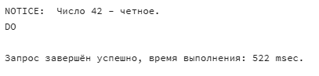
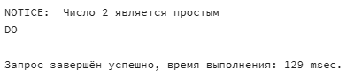

# ПРОМЕЖУТОЧНАЯ АТТЕСТАЦИЯ 2


Исполнитель: Боталов Константин Владимирович

* [Ссылка](https://github.com/botalov-pro/innopolis-practicum/blob/main/exam/EXAM_02.MD) на настоящую работу.
* [Ссылка](https://github.com/botalov-pro/innopolis-practicum/blob/main/exam/sql/exam_02.sql) на итоговый SQL-файл.

## Постановка задания

1. Через анонимный блок реализовать проверку целого числа на четность, число должно быть как переменная.
2. Через анонимный блок посчитать сколько четных и нечетных чисел в некотором промежутке чисел, левая граница и правая граница диапазона должны быть как переменные.
3. Через анонимный блок определить является ли число простым или нет, число должно быть как переменная.
4. Через анонимный блок посчитать сколько всего есть простых чисел в некотором промежутке чисел, левая граница и правая граница диапазона должны быть как переменные.
5. Вывести анонимным блоком таблицу умножения от 1 до 10 вертикально. Код должен быть как можно короче. Последний пример должен быть 10 * 10 = 100.
6. Имеются два натуральных числа, они должны быть как переменные. Необходимо найти наибольший общий делитель.
7. Вывести информацию про друзей каждого пользователя из БД социальной сети.
8. Усложненное необязательное. Вывести таблицу умножения от 1 до 10 примерно в таком же виде как на рисунке внизу.


## Выполнение задания

Создадим базу данных INNOPOLIS для выполнения заданий и проверим ее создание:

```postgresql
/* Удаление созданной базы данных INNOPOLIS (если существует) */
DROP DATABASE IF EXISTS innopolis;

/* Создание базы данных INNOPOLIS */
CREATE DATABASE innopolis;

/* Проверяем, что создалась наша база данных */
SELECT datname FROM pg_database
WHERE datname='innopolis';
```


**Результат:** база данных INNOPOLIS создана.

### Задание 1.

Через анонимный блок реализовать проверку целого числа на четность, число должно быть как переменная.

```postgresql
/*
   Задание 1.
   Через анонимный блок реализовать проверку целого числа на четность,
   число должно быть как переменная
*/
DO $$
DECLARE
    number INTEGER := 42;  -- Здесь можно задать любое целое число
BEGIN
    IF number % 2 = 0 THEN  -- Проверяем, делится ли число на 2 без остатка. Если да, то число четное.
        RAISE NOTICE 'Число % - четное.', number;  -- Выводим сообщение, если число - четное.
    ELSE
        RAISE NOTICE 'Число % - нечетное.', number;  -- Выводим сообщение, если число - нечетное.
    END IF;
END $$;
```




**Результат:** проверены 42, 55, 8 числа на четность. Результат правильный.

### Задание 2.

Через анонимный блок посчитать сколько четных и нечетных чисел в некотором промежутке чисел, левая граница и правая граница диапазона должны быть как переменные.

```postgresql
/*
   Задание 2.
   Через анонимный блок посчитать сколько четных и нечетных чисел в некотором промежутке чисел,
   левая граница и правая граница диапазона должны быть как переменные
*/
DO $$
DECLARE
    min_range INTEGER := 2;  -- левая граница диапазона
    max_range INTEGER := 4; -- правая граница диапазона
    even_count INTEGER := 0; -- счетчик четных чисел
    odd_count INTEGER := 0;  -- счетчик нечетных чисел
    i INTEGER;               -- переменная для итерации
BEGIN
    FOR i IN min_range..max_range LOOP
        IF i % 2 = 0 THEN
            even_count := even_count + 1;  -- увеличиваем счетчик четных чисел
        ELSE
            odd_count := odd_count + 1;    -- увеличиваем счетчик нечетных чисел
        END IF;
    END LOOP;

    RAISE NOTICE 'В промежутке от % до % всего % нечетных чисел и % четных', min_range, max_range, odd_count, even_count;
END $$;
```


**Результат:** проверены диапазоны от 1 до 11 и от 2 до 4. Результат правильный.

### Задание 3.

Через анонимный блок определить является ли число простым или нет, число должно быть как переменная.

```postgresql
/*
   Задание 3.
   Через анонимный блок определить является ли число простым или нет,
   число должно быть как переменная
*/
DO $$
DECLARE
    number INTEGER := 1; -- Здесь можно задать любое целое число, которое нужно проверить
    is_simple BOOLEAN := TRUE; -- Логическая переменная, которая будет изменяться при проверке числа.
    i INTEGER; -- счётчик итераций
BEGIN
    IF number < 2 THEN
        is_simple := FALSE; -- Число непростое, т.к. меньше 2
    ELSE
        /*
            Проверка на делимость от 2 до floor(sqrt(number)):
            sqrt - квадратный корень, floor - округление до ближайшего целого
        */
        FOR i IN 2..floor(sqrt(number)) LOOP --
            IF number % i = 0 THEN
                is_simple := FALSE; -- Если число делится на i, то НЕ простое
                EXIT;
            END IF;
        END LOOP;
    END IF;

    IF is_simple THEN
        RAISE NOTICE 'Число % является простым', number;
    ELSE
        RAISE NOTICE 'Число % НЕ является простым', number;
    END IF;
END $$;
```





**Результат:** проверены числа 1013, 2, 9, 1. Результат правильный.

### Задание 4.

Через анонимный блок посчитать сколько всего есть простых чисел в некотором промежутке чисел, левая граница и правая граница диапазона должны быть как переменные.

```postgresql
/*
   Задание 4.
   Через анонимный блок посчитать сколько всего есть простых чисел в некотором промежутке чисел,
   левая граница и правая граница диапазона должны быть как переменные
*/
DO $$
DECLARE
    min_range INT := 1;  -- Левая граница диапазона
    max_range INT := 1000;  -- Правая граница диапазона
    simple_count INT := 0;  -- Счетчик простых чисел
    number INT;  -- Счетчик текущего числа
    is_simple BOOLEAN;  -- Логическая переменная, которая будет изменяться при проверке числа.
BEGIN
    FOR number IN min_range..max_range LOOP
        IF number < 2 THEN
            CONTINUE;  -- Число непростое, т.к. меньше 2
        END IF;

        is_simple := TRUE;  -- Предположим, что number - простое

        /*
            Проверка на делимость от 2 до floor(sqrt(number)):
            sqrt - квадратный корень, floor - округление до ближайшего целого
        */
        FOR i IN 2..floor(sqrt(number)) LOOP
            IF number % i = 0 THEN
                is_simple := FALSE;  -- Если делится, то НЕ простое
                EXIT;
            END IF;
        END LOOP;

        IF is_simple THEN
            simple_count := simple_count + 1;  -- Увеличиваем счетчик простых чисел
        END IF;
    END LOOP;

    RAISE NOTICE 'В промежутке от % до % всего % простых чисел', min_range, max_range, simple_count;
END $$;
```


**Результат:** проверены диапазоны от 1 до 11, от 12 до 16, от 14 до 16 и от 1 до 1000. Результат правильный.

### Задание 5.

Вывести анонимным блоком таблицу умножения от 1 до 10 вертикально. Код должен быть как можно короче. Последний пример должен быть 10 * 10 = 100.

```postgresql
/*
   Задание 5.
   Вывести анонимным блоком таблицу умножения от 1 до 10 вертикально.
   Код должен быть как можно короче. Последний пример должен быть 10 * 10 = 100
*/
DO $$
DECLARE
    n INT;  -- 1 множитель
    i INT;  -- 2 множитель
BEGIN
    FOR n IN 1..10 LOOP
        FOR i IN 1..10 LOOP
            RAISE NOTICE '% * % = %', n, i, n * i;  -- Вывод в консоль вида 1 * 10 = 10
        END LOOP;
    END LOOP;
END $$;
```


...


**Результат:** выведена таблица умножения от 1 до 10.

### Задание 6.

Имеются два натуральных числа, они должны быть как переменные. Необходимо найти наибольший общий делитель.

```postgresql
/*
   Задание 6.
   Имеются два натуральных числа, они должны быть как переменные.
   Необходимо найти наибольший общий делитель.
*/
DO $$
DECLARE
    number1 INT := 1000;  -- 1е натуральное число
    number2 INT := 150;  -- 2е натуральное число
    num1 INT;
    num2 INT;
    nod INT; -- Наибольший общий делитель (НОД)
BEGIN
    /*
        Для нахождения НОД используем алгоритм Евклида:
        См. https://ru.wikipedia.org/wiki/Алгоритм_Евклида
    */
    num1 := number1;  -- Переприсваиваем первоначальные значения для number1..
    num2 := number2;  -- ..и number2

    WHILE num2 <> 0 LOOP  -- Пока 2е числе не будет равно 0 ...
        nod := num2;
        num2 := num1 % num2; -- ... последовательно делим
        num1 := nod;
    END LOOP;

    RAISE NOTICE 'НОД(%, %) равен %', number1, number2, nod;
END $$;
```


**Результат:** проверены диапазоны от 55 до 6, от 55 до 66 и от 1000 до 150. Результат правильный.

### Задание 8.

Вывести информацию про друзей каждого пользователя из БД социальной сети.

[Код базы данных](https://github.com/botalov-pro/innopolis-practicum/blob/main/exam/sql/exam_01.sql) социальной сети из промежуточной аттестации 1:

```postgresql
/*
   Задание 7.
   Вывести информацию про друзей каждого пользователя из БД социальной сети.

   Код базы данных социальной сети из промежуточной аттестации 1:
   https://github.com/botalov-pro/innopolis-practicum/blob/main/exam/sql/exam_01.sql
*/
DO $$
DECLARE
    user_record RECORD;
    friends_count INT;
    friends_list TEXT;
BEGIN
    FOR user_record IN SELECT id, firstname, lastname FROM users LOOP

        /* Считаем количество друзей для текущего пользователя */
        SELECT COUNT(*) INTO friends_count
        FROM friend_requests AS fr
        LEFT JOIN status s ON s.id = fr.status
        WHERE s.name = 'approved' AND (target_user_id = user_record.id OR initiator_user_id = user_record.id);

        /* Проверяем наличие друзей для текущего пользователя */
        IF friends_count > 0 THEN
            friends_list := '';

            /* Получаем список друзей текущего пользователя */
            SELECT * INTO friends_list
                FROM (
                        SELECT STRING_AGG(firstname || ' ' || lastname, ', ')
                            FROM friend_requests AS fr
                            LEFT JOIN status s on s.id = fr.status
                            LEFT JOIN users u on u.id = fr.initiator_user_id
                            WHERE s.name = 'approved' AND target_user_id = user_record.id
                        UNION
                        SELECT STRING_AGG(firstname || ' ' || lastname, ', ')
                            FROM friend_requests AS fr
                            LEFT JOIN status s on s.id = fr.status
                            LEFT JOIN users u on u.id = fr.target_user_id
                            WHERE s.name = 'approved' AND initiator_user_id = user_record.id
                     ) AS friends;

            RAISE NOTICE 'У пользователя % % друзья следующие: %', user_record.firstname, user_record.lastname, friends_list;
        ELSE
            RAISE NOTICE 'У пользователя % % друзей неть (', user_record.firstname, user_record.lastname;
        END IF;
    END LOOP;
END $$;
```


**Результат:** выведена таблица друзей пользователей.

### Задание 8.

Усложненное необязательное. Вывести таблицу умножения от 1 до 10 примерно в таком же виде как на рисунке внизу.


```postgresql
/*
   Задание 8.
   Усложненное необязательное. Вывести таблицу умножения от 1 до 10
   примерно в таком же виде как на рисунке внизу.
*/

/* Способ 1. */
DO $$
DECLARE
    n INT;  -- 1й множитель
    i INT;  -- 2й множитель
    col1 VARCHAR;  -- 1 колонка
    col2 VARCHAR;  -- 2 колонка
    col3 VARCHAR;  -- 3 колонка
    col4 VARCHAR;  -- 4 колонка
BEGIN

    FOR n IN 2..9 BY 4 LOOP  -- Разбиваем на горизонтальные группы
        FOR i IN 2..10 LOOP  -- Вычисляем примеры
            /* Заполяем колонки */
            col1 = CONCAT(n, ' * ', i, ' = ', n * i);
            col2 = CONCAT(n + 1, ' * ', i, ' = ', (n + 1) * i);
            col3 = CONCAT(n + 2, ' * ', i, ' = ', (n + 2) * i);
            col4 = CONCAT(n + 3, ' * ', i, ' = ', (n + 3) * i);

            /* Вывод в консоль колонок разделителем 2*Таб */
            RAISE NOTICE E'%\t\t%\t\t%\t\t%', col1, col2, col3, col4;
        END LOOP;
        RAISE NOTICE ' ';  -- Пустая строка между группами примеров
    END LOOP;
END $$;

/* Способ 2. Чуть улучшенный и оптимизированный */
DO $$
DECLARE
    i INT;  -- 1й множитель
    n INT;  -- 2й множитель
    row TEXT[];  -- Массив строки
BEGIN
    FOR n IN 2..9 BY 4 LOOP  -- Разбиваем на горизонтальные группы
        FOR i IN 2..10 LOOP  -- Вычисляем примеры
            row := ARRAY[
                FORMAT('%s * %s = %s', n, i, n * i),
                FORMAT('%s * %s = %s', n + 1, i, (n + 1) * i),
                FORMAT('%s * %s = %s', n + 2, i, (n + 2) * i),
                FORMAT('%s * %s = %s', n + 3, i, (n + 3) * i)
            ];  -- Заполняем массив примерами

            /* Вывод в консоль массива с разделителем 2*Таб */
            RAISE NOTICE E'%', array_to_string(row, E'\t\t');
        END LOOP;
        RAISE NOTICE ' ';  -- Пустая строка между группами примеров
    END LOOP;
END $$;
```
**Способ 1:**


**Способ 2:**


**Результат:** выведена таблица умножения от 1 до 10 в таком же виде как на прилагаемом рисунке выше двумя разными способами.