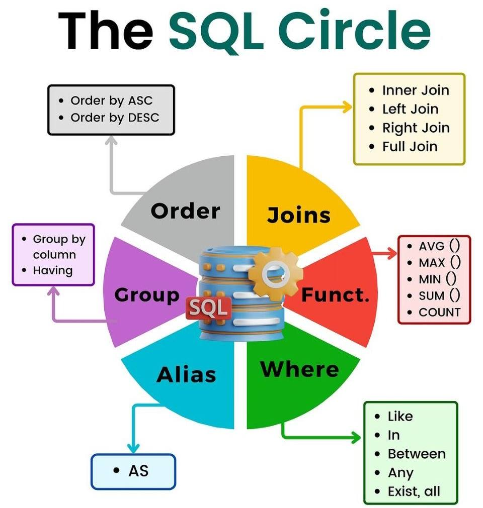

# Дополнительные материалы

- [Тренажер по SQL](https://sqltest.online/ru/question/sql-basics)
- [Руководство по стилю SQL](https://www.sqlstyle.guide/ru/)
- [Книги по SQL и базам данных](https://t.me/sqllibr)
- [Архив книг по базам данных](https://t.me/dblib)
- [https://t.me/dbbooks](https://t.me/dbbooks)
- [https://t.me/prosql](https://t.me/prosql)

