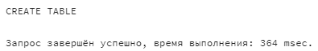
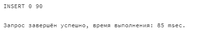
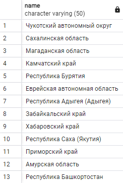
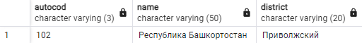
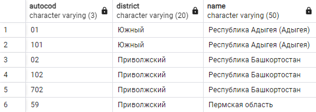
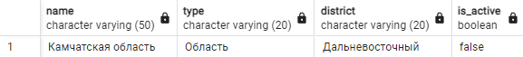
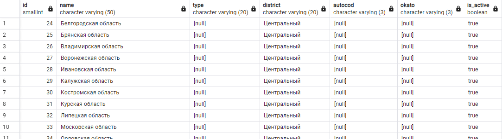
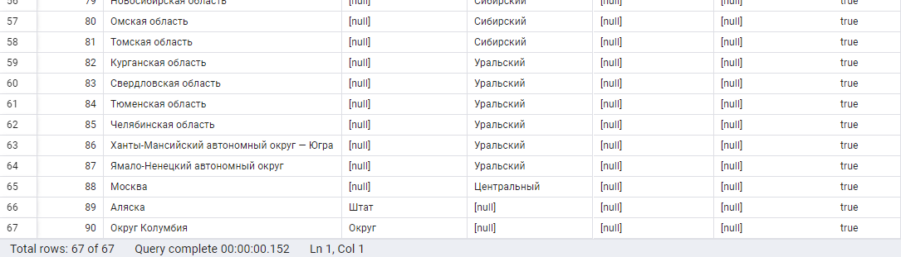
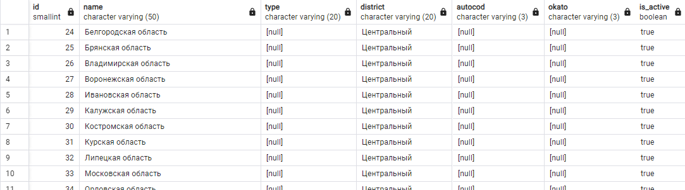
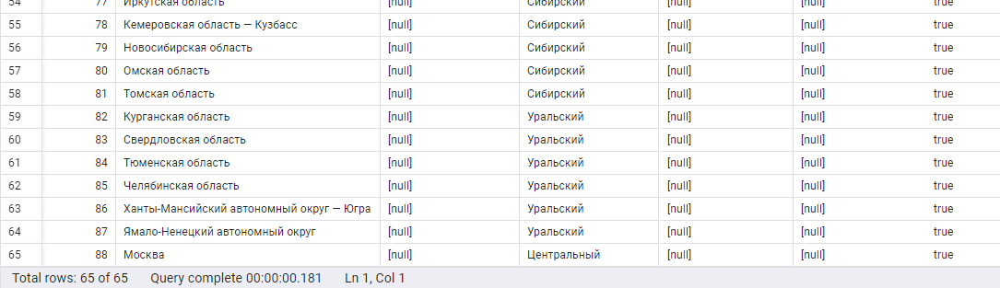

# ЗАДАНИЕ 1

   1) Создайте таблицу (7-12 строк, не менее 6 столбцов) и заполните ее значениями, включая NULL-значения.
   2) Выполните любые 5 запросов с фильтрацией командой WHERE и чтоб были AND OR NOT, и 2 запроса с обработкой параметра NULL (IS NULL, IS NOT NULL).

   Формат сдачи: word/pdf, где будет запрос и результат запроса

   Исполнитель: Боталов Константин Владимирович

## ВЫПОЛНЕНИЕ

[Ссылка](https://github.com/botalov-pro/innopolis-practicum/blob/main/homework/sql/homework_01.sql) на итоговый SQL-файл. 

1. Создание таблицы РЕГИОН
```postgresql
/* Создание таблицы РЕГИОН */
CREATE TABLE IF NOT EXISTS region               -- Создание таблицы с проверкой на наличие таблицы
(
    id SMALLSERIAL,                             -- Идентификатор региона
    name VARCHAR(50) NOT NULL,                  -- Наименование региона
    type VARCHAR(20),                           -- Тип региона
    district VARCHAR(20),                       -- Федеральный округ
    autocod VARCHAR(3),                         -- Код ГАИ региона (для транспортных средств)
    okato VARCHAR(3),                           -- Код ОКАТО
    is_active BOOLEAN DEFAULT(TRUE) NOT NULL    -- Действующий?
);
```


2. Создание таблицы РЕГИОН
```postgresql
/* Добавление данных в таблицу РЕГИОН */
INSERT INTO region
    (name, type, district, autocod, okato, is_active)
VALUES
    ('Республика Адыгея (Адыгея)', 'Республика', 'Южный', '01', '79', TRUE),
    ('Республика Адыгея (Адыгея)', 'Республика', 'Южный', '101', '79', TRUE),
    ('Республика Башкортостан', 'Республика', 'Приволжский', '02', '80', TRUE),
    ('Республика Башкортостан', 'Республика', 'Приволжский', '102', '80', TRUE),
    ('Республика Башкортостан', 'Республика', 'Приволжский', '702', '80', TRUE),
    ('Амурская область', 'Область', 'Дальневосточный', '28', '10', TRUE),
    ('Республика Бурятия', 'Республика', 'Дальневосточный', '03', '81', TRUE),
    ('Республика Бурятия', 'Республика', 'Дальневосточный', '103', '81', TRUE),
    ('Еврейская автономная область', 'Автономная область', 'Дальневосточный', '79', '99', TRUE),
    ('Забайкальский край', 'Край', 'Дальневосточный', '75', '76', TRUE),
    ('Забайкальский край', 'Край', 'Дальневосточный', '80', '76', TRUE),
    ('Камчатский край', 'Край', 'Дальневосточный', '41', '30', TRUE),
    ('Магаданская область', 'Область', 'Дальневосточный', '49', '44', TRUE),
    ('Приморский край', 'Край', 'Дальневосточный', '25', '05', TRUE),
    ('Приморский край', 'Край', 'Дальневосточный', '125', '05', TRUE),
    ('Приморский край', 'Край', 'Дальневосточный', '725', '05', TRUE),
    ('Республика Саха (Якутия)', 'Республика', 'Дальневосточный', '14', '98', TRUE),
    ('Сахалинская область', 'Область', 'Дальневосточный', '65', '64', TRUE),
    ('Хабаровский край', 'Край', 'Дальневосточный', '27', '08', TRUE),
    ('Чукотский автономный округ', 'Автономный округ', 'Дальневосточный', '87', '77', TRUE),
    ('Камчатская область', 'Область', 'Дальневосточный', '41', '30', FALSE),
    ('Пермская область', 'Область', 'Приволжский', '59', '57', FALSE),
    ('Читинская область', 'Область', 'Сибирский', '75', '76', FALSE),
    ('Белгородская область', NULL, 'Центральный', NULL, NULL, TRUE),
    ('Брянская область', NULL, 'Центральный', NULL, NULL, TRUE),
    ('Владимирская область', NULL, 'Центральный', NULL, NULL, TRUE),
    ('Воронежская область', NULL, 'Центральный', NULL, NULL, TRUE),
    ('Ивановская область', NULL, 'Центральный', NULL, NULL, TRUE),
    ('Калужская область', NULL, 'Центральный', NULL, NULL, TRUE),
    ('Костромская область', NULL, 'Центральный', NULL, NULL, TRUE),
    ('Курская область', NULL, 'Центральный', NULL, NULL, TRUE),
    ('Липецкая область', NULL, 'Центральный', NULL, NULL, TRUE),
    ('Московская область', NULL, 'Центральный', NULL, NULL, TRUE),
    ('Орловская область', NULL, 'Центральный', NULL, NULL, TRUE),
    ('Рязанская область', NULL, 'Центральный', NULL, NULL, TRUE),
    ('Смоленская область', NULL, 'Центральный', NULL, NULL, TRUE),
    ('Тамбовская область', NULL, 'Центральный', NULL, NULL, TRUE),
    ('Тверская область', NULL, 'Центральный', NULL, NULL, TRUE),
    ('Тульская область', NULL, 'Центральный', NULL, NULL, TRUE),
    ('Ярославская область', NULL, 'Центральный', NULL, NULL, TRUE),
    ('Республика Марий Эл', NULL, 'Приволжский', NULL, NULL, TRUE),
    ('Республика Мордовия', NULL, 'Приволжский', NULL, NULL, TRUE),
    ('Республика Татарстан', NULL, 'Приволжский', NULL, NULL, TRUE),
    ('Удмуртская Республика', NULL, 'Приволжский', NULL, NULL, TRUE),
    ('Чувашская Республика', NULL, 'Приволжский', NULL, NULL, TRUE),
    ('Пермский край', NULL, 'Приволжский', NULL, NULL, TRUE),
    ('Кировская область', NULL, 'Приволжский', NULL, NULL, TRUE),
    ('Нижегородская область', NULL, 'Приволжский', NULL, NULL, TRUE),
    ('Оренбургская область', NULL, 'Приволжский', NULL, NULL, TRUE),
    ('Пензенская область', NULL, 'Приволжский', NULL, NULL, TRUE),
    ('Самарская область', NULL, 'Приволжский', NULL, NULL, TRUE),
    ('Саратовская область', NULL, 'Приволжский', NULL, NULL, TRUE),
    ('Ульяновская область', NULL, 'Приволжский', NULL, NULL, TRUE),
    ('Республика Карелия', NULL, 'Северо-Западный', NULL, NULL, TRUE),
    ('Республика Коми', NULL, 'Северо-Западный', NULL, NULL, TRUE),
    ('Архангельская область', NULL, 'Северо-Западный', NULL, NULL, TRUE),
    ('Вологодская область', NULL, 'Северо-Западный', NULL, NULL, TRUE),
    ('Калининградская область', NULL, 'Северо-Западный', NULL, NULL, TRUE),
    ('Ленинградская область', NULL, 'Северо-Западный', NULL, NULL, TRUE),
    ('Мурманская область', NULL, 'Северо-Западный', NULL, NULL, TRUE),
    ('Новгородская область', NULL, 'Северо-Западный', NULL, NULL, TRUE),
    ('Псковская область', NULL, 'Северо-Западный', NULL, NULL, TRUE),
    ('Санкт-Петербург', NULL, 'Северо-Западный', NULL, NULL, TRUE),
    ('Ненецкий автономный округ', NULL, 'Северо-Западный', NULL, NULL, TRUE),
    ('Республика Дагестан', NULL, 'Северо-Кавказский', NULL, NULL, TRUE),
    ('Республика Ингушетия', NULL, 'Северо-Кавказский', NULL, NULL, TRUE),
    ('Кабардино-Балкарская Республика', NULL, 'Северо-Кавказский', NULL, NULL, TRUE),
    ('Карачаево-Черкесская Республика', NULL, 'Северо-Кавказский', NULL, NULL, TRUE),
    ('Республика Северная Осетия — Алания', NULL, 'Северо-Кавказский', NULL, NULL, TRUE),
    ('Чеченская Республика', NULL, 'Северо-Кавказский', NULL, NULL, TRUE),
    ('Ставропольский край', NULL, 'Северо-Кавказский', NULL, NULL, TRUE),
    ('Республика Алтай', NULL, 'Сибирский', NULL, NULL, TRUE),
    ('Республика Тыва', NULL, 'Сибирский', NULL, NULL, TRUE),
    ('Республика Хакасия', NULL, 'Сибирский', NULL, NULL, TRUE),
    ('Алтайский край', NULL, 'Сибирский', NULL, NULL, TRUE),
    ('Красноярский край', NULL, 'Сибирский', NULL, NULL, TRUE),
    ('Иркутская область', NULL, 'Сибирский', NULL, NULL, TRUE),
    ('Кемеровская область — Кузбасс', NULL, 'Сибирский', NULL, NULL, TRUE),
    ('Новосибирская область', NULL, 'Сибирский', NULL, NULL, TRUE),
    ('Омская область', NULL, 'Сибирский', NULL, NULL, TRUE),
    ('Томская область', NULL, 'Сибирский', NULL, NULL, TRUE),
    ('Курганская область', NULL, 'Уральский', NULL, NULL, TRUE),
    ('Свердловская область', NULL, 'Уральский', NULL, NULL, TRUE),
    ('Тюменская область', NULL, 'Уральский', NULL, NULL, TRUE),
    ('Челябинская область', NULL, 'Уральский', NULL, NULL, TRUE),
    ('Ханты-Мансийский автономный округ — Югра', NULL, 'Уральский', NULL, NULL, TRUE),
    ('Ямало-Ненецкий автономный округ', NULL, 'Уральский', NULL, NULL, TRUE),
    ('Москва', NULL, 'Центральный', NULL, NULL, TRUE),
    ('Аляска', 'Штат', NULL, NULL, NULL, TRUE),
    ('Округ Колумбия', 'Округ', NULL, NULL, NULL, TRUE)
;
```


3. Выбрать все существующие регионы РФ (где округ не Штат и Округ)
```postgresql
/* Выбрать все существующие регионы РФ (где округ не Штат и Округ) */
SELECT name
    FROM region
    WHERE
        is_active is TRUE
      AND
        type NOT IN ('Штат', 'Округ')
    GROUP BY name;
```


4. Найти регион и округ с автомобильным кодом 102 (точное совпадение)
```postgresql
/* Найти регион и округ с автомобильным кодом 102 (точное совпадение) */
SELECT autocod, name, district
    FROM region
    WHERE autocod = '102';
```


5. Какие автомобильные коды есть в Южном и Приволжском ФО
```postgresql
/* Какие автомобильные коды есть в Южном и Приволжском ФО */
SELECT autocod, district, name
    FROM region
    WHERE
        autocod IS NOT NULL
       AND
        (district = 'Южный'
             OR
         district = 'Приволжский')
;
```


6. Найти несуществующие области в Дальневосточном ФО
```postgresql
/* Найти несуществующие области в Дальневосточном ФО */
SELECT name, type, district, is_active
    FROM region
    WHERE
        type = 'Область'
      AND
        district = 'Дальневосточный'
      AND
        is_active IS NOT TRUE;
```


7. Найти существующие регионы, где не заполнены поля Округ, Код ГАИ или Код ОКАТО
```postgresql
/* Найти существующие регионы, где не заполнены поля Округ, Код ГАИ или Код ОКАТО */
SELECT *
    FROM region
    WHERE
        is_active IS TRUE
       AND
        (district IS NULL
             OR
         autocod IS NULL
             OR
         okato IS NULL)
;
```



8. Найти существующие регионы, где не указан тип
```postgresql
/* Найти существующие регионы, где не указан тип */
SELECT *
    FROM region
    WHERE
        is_active IS TRUE
      AND
        type IS NULL
;
```



## ЗАМЕЧАНИЯ ПРЕПОДАВАТЕЛЯ

Великолепное выполнение ДЗ. Продолжайте в таком же виде в git в формате markdown, очень удобно для просмотра.
Отлично форматирование SQL запросов.

Единственное замечание, IF NOT EXISTS, это прекрасно, НО для каждой таблицы должен быть первичный ключ, PRIMARY KEY, в контексте region выбор SMALLSERIAL поддерживаю, но вот если вы обеспокоились оптимизацией длинны типов данных, то возможно стоило использовать для столбцов autocod, okato вообще INT?