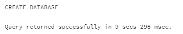
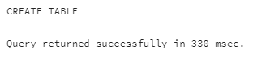
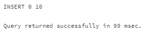
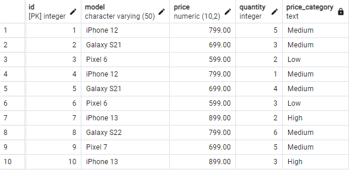
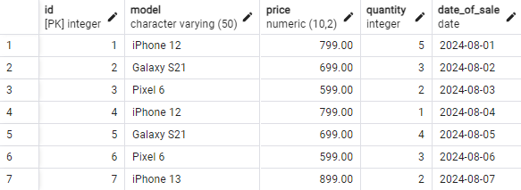
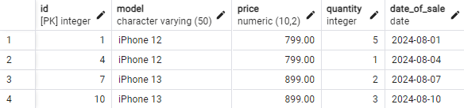
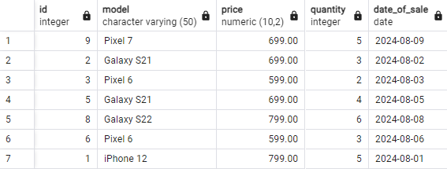
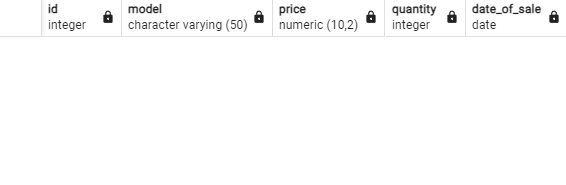
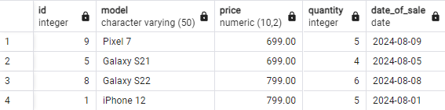

# ЗАДАНИЕ 2

   Исполнитель: Боталов Константин Владимирович

[Ссылка](https://github.com/botalov-pro/innopolis-practicum/blob/main/homework/sql/homework_02.sql) на итоговый SQL-файл.

## ПОДГОТОВКА К ВЫПОЛНЕНИЮ ЗАДАНИЯ

1. Создаем новую базу данных INNOPOLIS 
```postgresql
/* Создание базы данных INNOPOLIS */
CREATE DATABASE innopolis;
```


__Результат:__ база данных INNOPOLIS успешно создана.

2. Создаём таблицу SALES в базе данных INNOPOLIS 
```postgresql
/* Создание таблицы SALES в базе данных */
CREATE TABLE sales                  -- Создание таблицы sales
(
    id SERIAL PRIMARY KEY,          -- Идентификатор продажи (первичный ключ)
    model VARCHAR(50) NOT NULL,     -- Модель телефона
    price DECIMAL(10,2) NOT NULL,   -- Цена телефона
    quantity INTEGER NOT NULL,      -- Количество проданных единиц
    date_of_sale DATE NOT NULL      -- Дата продажи
);
```


__Результат:__ таблица SALES базы данных INNOPOLIS успешно создана.

3. Добавить данные в таблицу SALES
```postgresql
/* Добавление данных в таблицу SALES */
INSERT INTO sales
    (model, price, quantity, date_of_sale)
VALUES
    ('iPhone 12', 799, 5, '2024-08-01'),
    ('Galaxy S21', 699, 3, '2024-08-02'),
    ('Pixel 6', 599, 2, '2024-08-03'),
    ('iPhone 12', 799, 1, '2024-08-04'),
    ('Galaxy S21', 699, 4, '2024-08-05'),
    ('Pixel 6', 599, 3, '2024-08-06'),
    ('iPhone 13', 899, 2, '2024-08-07'),
    ('Galaxy S22', 799, 6, '2024-08-08'),
    ('Pixel 7', 699, 5, '2024-08-09'),
    ('iPhone 13', 899, 3, '2024-08-10')
;
```


__Результат:__ в таблицу SALES базы данных INNOPOLIS успешно добавлено 10 новых записей.

## ВЫПОЛНЕНИЕ ЗАДАНИЯ

### Задача 1: Использование оператора CASE

Напишите SQL-запрос, который будет отображать id, model, price, quantity, и еще один столбец с названием price_category, который будет иметь значения:
  * "High" для телефонов с ценой выше 800;
  * "Medium" для телефонов с ценой между 600 и 800 включительно;
  * "Low" для телефонов с ценой ниже 600.
```postgresql
/* Задача 1 */
SELECT id, model, price, quantity,
        CASE
            WHEN price > 800 THEN 'High'        -- Выше 800
            WHEN price >= 600 THEN 'Medium'     -- Между 600 и 800
            ELSE 'Low'                          -- Ниже 600
        END AS price_category
    FROM sales
;
```


__Результат:__ в таблицу SALES добавлен новый столбец price_category, который заполняется в зависимости от стоимости телефона. В таблице 2 модели телефона категории "High", 6 моделей телефона категории "Medium" и 2 модели телефона категории "Low".

### Задача 2: Использование оператора BETWEEN

Напишите SQL-запрос, который возвращает все продажи телефонов, которые произошли в первой неделе августа 2024 года (с 1 по 7 августа включительно).
```postgresql
/* Задача 2 */
SELECT *
    FROM sales
    WHERE
        date_of_sale BETWEEN '2024-08-01' AND '2024-08-07'
;
```


__Результат:__ запрос вернул 7 записей, соответствующих продажам в первую неделю августа 2024 года (с 1 по 7 августа включительно).

### Задача 3: Использование оператора LIKE

Напишите SQL-запрос, который возвращает все продажи моделей телефонов, которые начинаются с "iPhone".
```postgresql
/* Задача 3 */
SELECT *
    FROM sales
    WHERE
        model LIKE 'iPhone%'
;
```


__Результат:__ запрос вернул 4 записи, соответствующих продажам моеделей телефонов, начинающихся с "iPhone" (iPhone 12 - 2 записи, iPhone 13 - 2 записи).

### Задача 4a: Операции с множествами (UNION)

Напишите два запроса. Один должен возвращать все продажи телефонов с ценой ниже 700, а •другой — все продажи, где было продано более 3 единиц. Затем объедините результаты этих двух запросов с помощью UNION.
```postgresql
/* Задача 4a */
SELECT *                -- Все продажи телефонов с ценой ниже 700
    FROM sales
    WHERE
        price < 700
UNION                   -- Объединить с ...
SELECT *                -- Все продажи, где было продано более 3 единиц
    FROM sales
    WHERE
        quantity > 3
;
```


__Результат:__ запрос вернул 7 записей продаж, объединяющих запросы по цене ниже 700 и количество продаж более 3 единиц.

### Задача 4b: Операции с множествами (EXCEPT)

Напишите два запроса. Первый должен возвращать все продажи телефонов модели "Galaxy S21", а •второй — все продажи телефонов с количеством проданных единиц больше 2. Используйте EXCEPT, чтобы найти продажи "Galaxy S21", где количество проданных единиц меньше или равно 2
```postgresql
/* Задача 4b */
SELECT *                -- Все продажи телефонов модели "Galaxy S21"
    FROM sales
    WHERE
        model = 'Galaxy S21'
EXCEPT                  -- Объединить c исключением ...
SELECT *                -- Все продажи телефонов с количеством проданных единиц больше 2
    FROM sales
    WHERE
        quantity > 2
;
```


__Результат:__ запрос вернул 0 записей, т.к. записи, удовлетворяющие условиям (телефон модели "Galaxy S21" и количество проданных единиц 2 и менее), отсутствуют.

### Задача 4c: Операции с множествами (INTERSECT)

Напишите два запроса. Один должен возвращать все продажи, где было продано более 3 единиц, а другой — все продажи, где цена была ниже 800. Используйте INTERSECT, чтобы найти продажи, удовлетворяющие обоим условиям.
```postgresql
/* Задача 4c */
SELECT *                -- Все продажи, где было продано более 3 единиц
    FROM sales
    WHERE
        quantity > 3
INTERSECT               -- Объединить c пересечением ...
SELECT *                -- Все продажи, где цена была ниже 800
    FROM sales
    WHERE
        price < 800
;
```


__Результат:__ запрос вернул 4 записи продаж, которые удовлетворяют условиям (количество проданных единиц больше 3 и цена ниже 800).