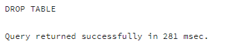

# ЗАДАНИЕ 3

   Исполнитель: Боталов Константин Владимирович

[Ссылка](sql/homework_03.sql) на итоговый SQL-файл.

## ПОДГОТОВКА К ВЫПОЛНЕНИЮ ЗАДАНИЯ

1. У нас уже имеется база данных INNOPOLIS
2. На всякий случай удаляем существующие таблицы WORKERS, DEPARTMENTS, JOBS из базы данных INNOPOLIS:
```postgresql
/* Удаление созданных таблиц */
DROP TABLE IF EXISTS workers;
DROP TABLE IF EXISTS departments;
DROP TABLE IF EXISTS jobs;
```


__Результат:__ таблицы WORKERS, DEPARTMENTS, JOBS успешно удалены.

3. Создаем таблицы WORKERS, DEPARTMENTS, JOBS заново:
```postgresql
/* Создание таблицы JOBS */
CREATE TABLE jobs (
    j_id SERIAL PRIMARY KEY,
	name_job VARCHAR(45)
                  );

/* Создание таблицы DEPARTMENTS */
CREATE TABLE departments (
	d_id SERIAL  PRIMARY KEY,
	name_dept VARCHAR(45)
                         );

/* Создание таблицы WORKERS */
CREATE TABLE workers (
    w_id INT PRIMARY KEY,
    name_worker VARCHAR(45),
    dept_id INT REFERENCES departments,
    job_id INT REFERENCES jobs,
    salary INT
                     );
```


__Результат:__ таблицы WORKERS, DEPARTMENTS, JOBS успешно созданы.

4. Добавляем данные в таблицы WORKERS, DEPARTMENTS, JOBS
```postgresql
/* Добавление данных в таблицу JOBS */
INSERT INTO jobs (name_job)
    VALUES ('специалист'), ('помощник'), ('начальник');

/* Добавление данных в таблицу DEPARTMENTS */
INSERT INTO departments (name_dept)
    VALUES  ('Sales'),
	    ('IT'),
	    ('Marketing'),
	    ('Accounting'),
	    ('Administration');

/* Добавление данных в таблицу WORKERS */
INSERT INTO workers (w_id, name_worker, dept_id, job_id,salary)
    VALUES
        (100, 'AndreyEx', 1, 1, 50000),
        (200, 'Boris', 2, 3, 55000),
        (300, 'Anna', 2, 2, 70000),
        (400, 'Anton', 3, 1, 95000),
    	(500, 'Dima', 2, 2, 60000),
    	(600, 'Трофим', 3, 2, 60000),
    	(501, 'Maxs', 4, 1,35000),
    	(700, 'Helen', 4, 3, 65000),
    	(800, 'Igor', 5, 1, 56000);
```


__Результат:__ в таблицы WORKERS, DEPARTMENTS, JOBS базы данных INNOPOLIS успешно добавлено новые записи.

## ВЫПОЛНЕНИЕ ЗАДАНИЯ