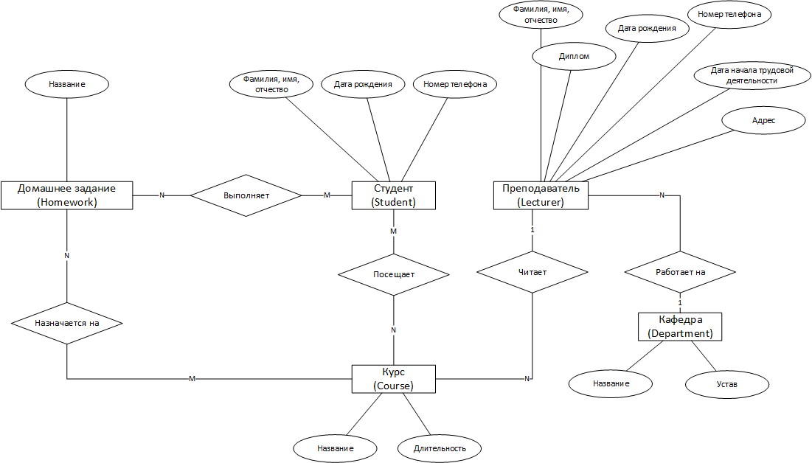
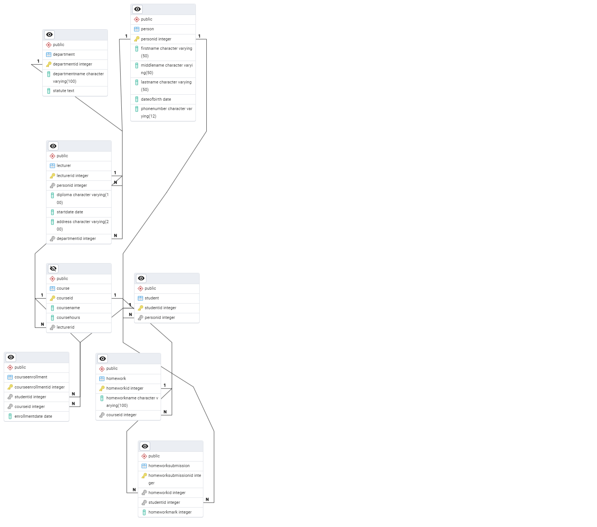

# ЗАДАНИЕ 4

Исполнитель: Боталов Константин Владимирович

[Ссылка]()

## Постановка задания

* В университете есть студенты и преподаватели.
* Преподаватели работают на кафедрах: на одной кафедре может работать несколько преподавателей, но каждый преподаватель работает строго на одной кафедре.
* Преподаватели читают курсы. Один преподаватель может читать несколько курсов, но каждый курс читается строго одним преподавателем.
* Студенты посещают курсы, на которые они зачислены. При этом каждый студент может посещать несколько курсов, и каждый курс может посещаться несколькими студентами.

**Кроме того:**
* У всех людей есть Ф. И. О., дата рождения и номер телефона.
* У преподавателей к этому добавляется информация про диплом, дата начала трудовой деятельности, адрес проживания.
* Зачисление каждого студента на курс происходит в определённую дату.
* Каждый курс длится определённое количество часов.
* У кафедры есть название и устав — небольшой фрагмент текста, в котором говорится, чем занимается кафедра.

**Усложненное условие (необязательное):**
* Также в университете есть домашние задания, с помощью которых преподаватели проверяют, как учащиеся усваивают материал.
* На каждом курсе может быть несколько домашних заданий, при этом одно и то же домашнее задание может быть назначено нескольким студентам, а каждый студент может работать над несколькими заданиями сразу.

**Необходимо:**
* Составить инфологическую модель, включая основные сущности и связи между ними.
* На основе инфологической модели создать логическую (или физическую) модель. Определить таблицы, ключи и связи. Убедиться, что каждая таблица имеет уникальный ключ.
* Выполнить нормализацию как минимум до 3НФ.
* Сгенерировать код создания всей БД.

## Выполнение задания

### Инфологическая модель

#### Определение сущностей

Из условий задания можно выделить следующие основные сущности:

```
- Студент (Student)
- Преподаватель (Lecturer)
- Кафедра (Department)
- Курс (Course)
- Домашнее задание (Homework)
```

#### Определение связей

Определим основные связи между сущностями:

* **Преподаватель** работает на **Кафедре** (1:N)
* **Преподаватель** читает **Курсы** (1:N)
* **Студент** посещает **Курсы** (M:N)
* **Домашнее задание** назначается на **Курс** (M:N)
* **Студент** выполняет **Домашние задания** (M:N)

#### Определение атрибутов

Определим основные атрибуты сущностей:

| **Студент (Student)** |
|---------------------------------|
| Фамилия, имя, отчество          |
| Дата рождения                   |
| Номер телефона                  |

| **Преподаватель (Lecturer)** |
|----------------------------------------|
| Фамилия, имя, отчество                 |
| Дата рождения                          |
| Номер телефона                         |
| Диплом                                 |
| Дата начала трудовой деятельности      |
| Адрес                                  |

| **Кафедра (Department)** |
|---------------------------|
| Название                  |
| Устав                     |

| **Курс (Course)** |
|-----------------------------|
| Название                    |
| Длительность                |

| **Домашнее задание (Homework)** |
|-------------------------------------------|
| Название                                  |

#### Создание диаграммы

Исходя из основных сущностей, связей и атрибутов сформируем инфологическую диаграмму:



**Результат:** составлена инфологическая модель, включая основные сущности и связи между ними.

### Даталогическая модель

На основе инфологической модели построим логическую и физическую модели.

#### Создание таблиц

Создадим следующие таблицы:

```sql
- Student       -- для сущности "Студент"
- Lecturer      -- для сущности "Преподаватель" 
- Department    -- для сущности "Кафедра"
- Course        -- для сущности "Курс"
- Homework      -- для сущности "Домашнее задание"
```

#### Создание полей

На основе созданных таблиц и атрибутов сущностей создадим необходимые поля:

```sql
/* Таблица "Student" */
- StudentName -- атрибут "Фамилия, имя, отчество студента" 
- DateOfBirth -- атрибут "Дата рождения"
- PhoneNumber -- атрибут "Номер телефона"
```

```sql
/* Таблица "Lecturer" */
- LecturerName  -- атрибут "Фамилия, имя, отчество"
- DateOfBirth   -- атрибут "Дата рождения"
- PhoneNumber   -- атрибут "Номер телефона"
- Diploma       -- атрибут "Диплом"
- StartDate     -- атрибут "Дата начала трудовой деятельности" 
- Address       -- атрибут "Адрес"
```

```sql
/* Таблица "Department" */
- DepartmentName    -- атрибут "Название" 
- Statute           -- атрибут "Устав"
```

```sql
/* Таблица "Course" */
- CourseName        -- атрибут "Название"
- CourseHours       -- атрибут "Длительность"
```

```sql
/* Таблица "Homework" */
- HomeworkName  -- атрибут "Название"
```

#### Определение типов данных

Определим для каждого поля необходимый тип данных и ограничения:

```postgresql
/* Таблица "Student" */
- StudentName VARCHAR(50) NOT NULL      -- атрибут "Фамилия, имя, отчество студента" 
- DateOfBirth DATE NOT NULL             -- атрибут "Дата рождения"
- PhoneNumber VARCHAR(12) NOT NULL      -- атрибут "Номер телефона"
```

```postgresql
/* Таблица "Lecturer" */
- LecturerName VARCHAR(50) NOT NULL     -- атрибут "Фамилия, имя, отчество"
- DateOfBirth DATE NOT NULL             -- атрибут "Дата рождения"
- PhoneNumber VARCHAR(12) NOT NULL      -- атрибут "Номер телефона"
- Diploma VARCHAR(100) NOT NULL         -- атрибут "Диплом"
- StartDate DATE NOT NULL               -- атрибут "Дата начала трудовой деятельности" 
- Address VARCHAR(200) NOT NULL         -- атрибут "Адрес"
```

```postgresql
/* Таблица "Department" */
- DepartmentName VARCHAR(100) NOT NULL  -- атрибут "Название" 
- Statute TEXT NOT NULL                 -- атрибут "Устав"
```

```postgresql
/* Таблица "Course" */
- CourseName VARCHAR(100) NOT NULL      -- атрибут "Название"
- CourseHours INT NOT NULL              -- атрибут "Длительность"
```

```postgresql
/* Таблица "Homework" */
- HomeworkName VARCHAR(100) NOT NULL        -- атрибут "Название"
```

#### Создание ключей и связей

Для каждой таблицы создадим ключи и необходимые связи:

```postgresql
/* Таблица "Student" */
- StudentID INT PRIMARY KEY             -- идентификатор студента (первичный ключ)
- StudentName VARCHAR(50) NOT NULL      -- атрибут "Фамилия, имя, отчество студента" 
- DateOfBirth DATE NOT NULL             -- атрибут "Дата рождения"
- PhoneNumber VARCHAR(12) NOT NULL      -- атрибут "Номер телефона"
```

```postgresql
/* Таблица "Lecturer" */
- LecturerID INT PRIMARY KEY            -- идентификатор преподавателя (первичный ключ)
- LecturerName VARCHAR(50) NOT NULL     -- атрибут "Фамилия, имя, отчество"
- DateOfBirth DATE NOT NULL             -- атрибут "Дата рождения"
- PhoneNumber VARCHAR(12) NOT NULL      -- атрибут "Номер телефона"
- Diploma VARCHAR(100) NOT NULL         -- атрибут "Диплом"
- StartDate DATE NOT NULL               -- атрибут "Дата начала трудовой деятельности" 
- Address VARCHAR(200) NOT NULL         -- атрибут "Адрес"
- DepartmentID INT NOT NULL             -- идентификатор кафедры, на которой работает преподаватель
- FOREIGN KEY (DepartmentID) REFERENCES Department(DepartmentID)  -- связь с таблицей "Кафедры"
```

```postgresql
/* Таблица "Department" */
- DepartmentID INT PRIMARY KEY          -- идентификатор кафедры (первичный ключ)
- DepartmentName VARCHAR(100) NOT NULL  -- атрибут "Название" 
- Statute TEXT NOT NULL                 -- атрибут "Устав"
```

```postgresql
/* Таблица "Course" */
- CourseID INT PRIMARY KEY              -- идентификатор курса (первичный ключ)
- CourseName VARCHAR(100) NOT NULL      -- атрибут "Название"
- CourseHours INT NOT NULL              -- атрибут "Длительность"
- LecturerID INT NOT NULL               -- идентификатор преподавателя, читающего курс
- FOREIGN KEY (LecturerID) REFERENCES Lecturer(LecturerID)  -- связь с таблицей "Преподаватели"
```

```postgresql
/* Таблица "Homework" */
- HomeworkID INT PRIMARY KEY                -- идентификатор домашней работы (первичный ключ)
- HomeworkName VARCHAR(100) NOT NULL        -- атрибут "Название"
- CourseID INT NOT NULL                     -- идентификатор курса по которому задается домашнее задание
- FOREIGN KEY (CourseID) REFERENCES Course(CourseID)  -- связь с таблицей "Курсы"
```

Кроме того, для реализации связи многие-ко-многим между **Домашнее задание**-**Курс** и **Студент**-**Домашние задания** создадим соединительные таблицы:

```postgresql
/* Соединительная таблица CourseEnrollment (Зачисление на курс) */
- CourseEnrollmentID INT PRIMARY KEY        -- идентификатор зачисления на курс (первичный ключ)
- StudentID INT NOT NULL                    -- идентификатор студента
- CourseID INT NOT NULL                     -- идентификатор курса
- EnrollmentDate DATE NOT NULL              -- Дата зачисления на курс
- FOREIGN KEY (StudentID) REFERENCES Student(StudentID) -- связь с таблицей "Студенты"
- FOREIGN KEY (CourseID) REFERENCES Course(CourseID)    -- связь с таблицей "Курсы"
```

```postgresql
/* Соединительная таблица HomeworkSubmission (Выполнение домашнего задания) */
- HomeworkSubmissionID INT PRIMARY KEY      -- идентификатор выполнения домашнего задания (первичный ключ)
- HomeworkID INT NOT NULL                   -- идентификатор домашнего задания
- StudentID INT NOT NULL                    -- идентификатор студента
- HomeworkMark INT NOT NULL                 -- оценка домашней работы
- FOREIGN KEY (HomeworkID) REFERENCES Homework(HomeworkID)  -- связь с таблицей "Домашняя работа"
- FOREIGN KEY (StudentID) REFERENCES Student(StudentID)     -- связь с таблицей "Студенты"
```

**Результат:** на основе инфологической модели создана логическая (и физическая) модель. Определены таблицы, ключи и связи. Каждая таблица имеет уникальный ключ.

### Нормализация базы данных

* 1НФ: Все атрибуты имеют атомарные значения.
* 2НФ: Все неключевые атрибуты полностью зависят от первичного ключа.
* 3НФ: Все неключевые атрибуты не зависят от других неключевых атрибутов.

Так как в таблице "Студенты" и "Преподаватели" имеются общие данные о персонах (Фамилия, имя, отчество, дата рождения, номер телефона), то для достижения 3НФ вынесем эти данные в отдельную таблицу **Person** (Физические лица):   

```postgresql
/* Таблица "Person" (Физические лица) */
- PersonID INT PRIMARY KEY              -- идентификатор физического лица (первичный ключ)
- FirstName VARCHAR(50) NOT NULL        -- имя физического лица 
- MiddleName VARCHAR(50)                -- отчество физического лица
- LastName VARCHAR(50) NOT NULL         -- фамилия физического лица
- DateOfBirth DATE NOT NULL             -- атрибут "Дата рождения"
- PhoneNumber VARCHAR(12) NOT NULL      -- атрибут "Номер телефона"
```

Таблицы "Студент" и "Преподаватель" в этом случае будут упрощены:

```postgresql
/* Таблица "Student" */
- StudentID INT PRIMARY KEY             -- идентификатор студента (первичный ключ)
- PersonID INT NOT NULL UNIQUE          -- идентификатор физического лица
- FOREIGN KEY (PersonID) REFERENCES Person(PersonID)    -- связь с таблицей "Физические лица"
```

```postgresql
/* Таблица "Lecturer" */
- LecturerID INT PRIMARY KEY            -- идентификатор преподавателя (первичный ключ)
- PersonID INT NOT NULL UNIQUE          -- идентификатор физического лица
- Diploma VARCHAR(100) NOT NULL         -- атрибут "Диплом"
- StartDate DATE NOT NULL               -- атрибут "Дата начала трудовой деятельности" 
- Address VARCHAR(200) NOT NULL         -- атрибут "Адрес"
- DepartmentID INT NOT NULL             -- идентификатор кафедры, на которой работает преподаватель
- FOREIGN KEY (DepartmentID) REFERENCES Department(DepartmentID)  -- связь с таблицей "Кафедры"
- FOREIGN KEY (PersonID) REFERENCES Person(PersonID)    -- связь с таблицей "Физические лица"
```

### Создание базы данных

#### Схема готовой базы данных



#### Код создания БД:

```postgresql
/* Удаление созданной базы данных INNOPOLIS */
DROP DATABASE IF EXISTS innopolis;

/* Создание базы данных INNOPOLIS */
CREATE DATABASE innopolis;

/* Создание таблицы PERSON (Физические лица) */
CREATE TABLE Person
(
    PersonID INT PRIMARY KEY,               -- идентификатор физического лица (первичный ключ)
    FirstName VARCHAR(50) NOT NULL,         -- имя физического лица
    MiddleName VARCHAR(50),                 -- отчество физического лица
    LastName VARCHAR(50) NOT NULL,          -- фамилия физического лица
    DateOfBirth DATE NOT NULL,              -- атрибут "Дата рождения"
    PhoneNumber VARCHAR(12) NOT NULL        -- атрибут "Номер телефона"
);

/* Создание таблица STUDENT (Студент) */
CREATE TABLE Student
(
    StudentID INT PRIMARY KEY,                          -- идентификатор студента (первичный ключ)
    PersonID  INT NOT NULL UNIQUE,                      -- идентификатор физического лица
    FOREIGN KEY (PersonID) REFERENCES Person (PersonID) -- связь с таблицей "Физические лица"
);

/* Создание таблицы DEPARTMENT (Кафедра) */
CREATE TABLE Department
(
    DepartmentID INT PRIMARY KEY,            -- идентификатор кафедры (первичный ключ)
    DepartmentName VARCHAR(100) NOT NULL,    -- атрибут "Название"
    Statute TEXT NOT NULL                    -- атрибут "Устав"
);

/* Создание таблицы LECTURER (Преподаватель) */
CREATE TABLE Lecturer
(
    LecturerID INT PRIMARY KEY,            -- идентификатор преподавателя (первичный ключ)
    PersonID INT NOT NULL UNIQUE,          -- идентификатор физического лица
    Diploma VARCHAR(100) NOT NULL,         -- атрибут "Диплом"
    StartDate DATE NOT NULL,               -- атрибут "Дата начала трудовой деятельности"
    Address VARCHAR(200) NOT NULL,         -- атрибут "Адрес"
    DepartmentID INT NOT NULL,             -- идентификатор кафедры, на которой работает преподаватель
    FOREIGN KEY (DepartmentID) REFERENCES Department(DepartmentID),  -- связь с таблицей "Кафедры"
    FOREIGN KEY (PersonID) REFERENCES Person(PersonID) -- связь с таблицей "Физические лица"
);

/* Создание таблицы COURSE (Курс) */
CREATE TABLE Course
(
    CourseID INT PRIMARY KEY,              -- идентификатор курса (первичный ключ)
    CourseName VARCHAR(100) NOT NULL,      -- атрибут "Название"
    CourseHours INT NOT NULL,              -- атрибут "Длительность"
    LecturerID INT NOT NULL,               -- идентификатор преподавателя, читающего курс
    FOREIGN KEY (LecturerID) REFERENCES Lecturer(LecturerID) -- связь с таблицей "Преподаватели"
);

/* Создание таблицы HOMEWORK (Домашняя работа) */
CREATE TABLE Homework
(
    HomeworkID INT PRIMARY KEY,                -- идентификатор домашней работы (первичный ключ)
    HomeworkName VARCHAR(100) NOT NULL,        -- атрибут "Название"
    CourseID INT NOT NULL,                     -- идентификатор курса по которому задается домашнее задание
    FOREIGN KEY (CourseID) REFERENCES Course(CourseID) -- связь с таблицей "Курсы"
);

/* Создание соединительной таблицы COURSEENROLLMENT (Зачисление на курс) */
CREATE TABLE CourseEnrollment
(
    CourseEnrollmentID INT PRIMARY KEY,                     -- идентификатор зачисления на курс (первичный ключ)
    StudentID          INT  NOT NULL,                       -- идентификатор студента
    CourseID           INT  NOT NULL,                       -- идентификатор курса
    EnrollmentDate     DATE NOT NULL,                       -- Дата зачисления на курс
    FOREIGN KEY (StudentID) REFERENCES Student (StudentID), -- связь с таблицей "Студенты"
    FOREIGN KEY (CourseID) REFERENCES Course (CourseID)     -- связь с таблицей "Курсы"
);

/* Создание соединительной таблицы HOMEWORKSUBMISSION (Выполнение домашнего задания) */
CREATE TABLE HomeworkSubmission
(
    HomeworkSubmissionID INT PRIMARY KEY,      -- идентификатор выполнения домашнего задания (первичный ключ)
    HomeworkID INT NOT NULL,                   -- идентификатор домашнего задания
    StudentID INT NOT NULL,                    -- идентификатор студента
    HomeworkMark INT NOT NULL,                 -- оценка домашней работы
    FOREIGN KEY (HomeworkID) REFERENCES Homework(HomeworkID),  -- связь с таблицей "Домашняя работа"
    FOREIGN KEY (StudentID) REFERENCES Student(StudentID)  -- связь с таблицей "Студенты"
);
```

Данная модель соответствует требованиям задачи и обеспечивает целостность данных. Все таблицы имеют уникальные первичные ключи, а связи между ними реализованы с помощью внешних ключей. Модель была нормализована до 3НФ.
