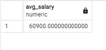
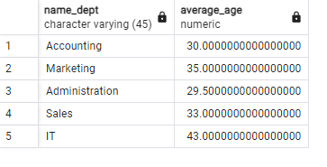
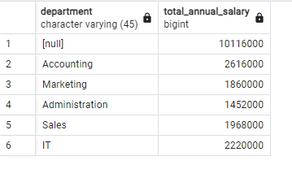

# ЗАДАНИЕ 7

Исполнитель: Боталов Константин Владимирович

* [Ссылка на настоящий файл](https://github.com/botalov-pro/innopolis-practicum/blob/main/homework/HOMEWORK_07.MD)
* [Ссылка на финальный SQL-файл](https://github.com/botalov-pro/innopolis-practicum/blob/main/homework/sql/homework_07.sql)


## Постановка задания

1. Подгружаем в БД файл [HW_task_7.sql](https://github.com/botalov-pro/innopolis-practicum/blob/main/homework/src/HW_task_7.sql).
2. Найти среднюю зарплату всех кто родился после 01.01.1990
3. Найти средний возраст (по полным годам) всех по отделам с указанием наименований отделов
4. Найти суммарную годовую зарплату по каждому отделу и итого по компании
5. Найти количество сотрудников во всех возможных комбинациях отдел – должность
6. Для каждой должности соберите имена сотрудников как массив
7. Создайте итоги по отделу и должности по средней зарплате (ROLLUP используем)
8. (усложненное необязательное) Найдите в одном запросе отдел, где моложе всего сотрудники в среднем, и посчитайте для него среднюю заработную плату, то есть должно быть три столбца - имя отдела, средний возраст там, средняя зарплата там

## Выполнение задания

### Задача 1.

Найти среднюю зарплату всех кто родился после 01.01.1990

```postgresql
/* Задача 1.
   Найти среднюю зарплату всех кто родился после 01.01.1990
*/
SELECT AVG(salary) AS avg_salary
FROM workers
WHERE birthday > '1990-01-01';
```



**Результат:** средняя зарплата всех, кто родился после 01.01.1990 г., составляет **60900**.

### Задача 2.

Найти средний возраст (по полным годам) всех по отделам с указанием наименований отделов.

```postgresql
/* Задача 2.
   Найти средний возраст (по полным годам) всех по отделам с указанием наименований отделов.
*/
SELECT
    d.name_dept,
    AVG(    -- Вычисляем средний возраст сотрудников
            -- Вычисляем возраст всех сотрудников (на текущую дату) и извлекаем количество полных лет
            EXTRACT(YEAR FROM age(w.birthday))
    ) AS average_age -- Записываем возраст в полных годах для каждого работника в отдельный столбец
FROM
    workers AS w
JOIN
    departments AS d ON w.dept_id = d.d_id -- Соединяем таблицы workers и departments по ключу dept_id
GROUP BY
    d.name_dept; -- Группируем данные по названиям отделов
```



**Результат:** вычислили средний возраст сотрудиков по отделам. Самый "молодой" отдел - Administraton (средний возраст 29,5 лет). Самый "старый" отдел - IT (средний возраст 43 года).

### Задача 3.

Найти суммарную годовую зарплату по каждому отделу и итого по компании

```postgresql
/* Задача 3.
    Найти суммарную годовую зарплату по каждому отделу и итого по компании
*/
SELECT d.name_dept AS department,
       SUM(w.salary) * 12 AS total_annual_salary  -- Вычисляем общую зарплату по отделу в месяц и год (12 месяцев)
FROM workers w
JOIN departments d ON w.dept_id = d.d_id
GROUP BY ROLLUP (d.name_dept);  -- Группируем по отделам и выводим информацию по всей компании (ROLLUP)
```



**Результат:** вычислили суммарную годовую зарплату по каждому отделу. Самый "дорогой" отдел - Accounting (**2 615 000** в год). Самый "экономный" отдел - Administration (**1 452 000** в год). Годовой бюджет компании на заработную плату составляет **10 116 000**. 